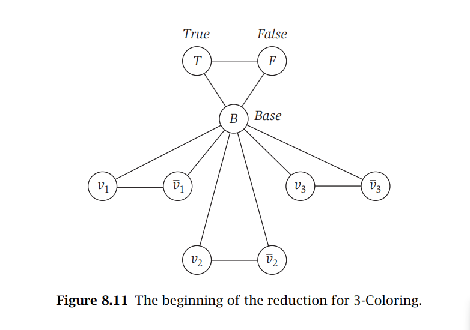
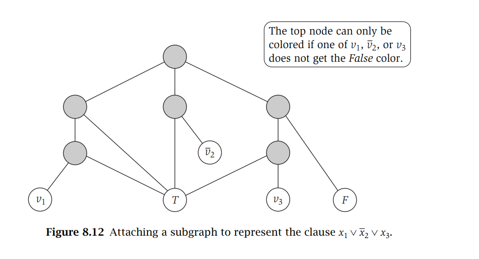

## Definiciones

- **La clase de complejidad P** corresponde a todos los problemas que pueden ser resueltos en tiempo polinomial.
- **La clase de complejidad NP** (viene de tiempo polinomial no-determinístico) corresponde a la clase de problemas cuya solución puede ser verificada en tiempo polinomial.

## Demostración de NP-completitud

Para demostrar que un problema es NP-completo se requieren dos pasos principales:

1. **Demostrar que el problema está en NP**:

   - Esto significa que, dada una solución candidata, podemos verificar en tiempo polinomial si esa solución es correcta.
2. **Demostrar que el problema es NP-duro**:

   - Esto significa que el problema es al menos tan difícil como cualquier otro problema en NP.
   - Se logra mostrando que un problema conocido como NP-completo se puede reducir en tiempo polinomial al problema en cuestión.

## Ejercicio 0: Demostrar que k coloring es Np completo K>= 3

3_coloring es np completo

### Demostrar que está en  NP

El problema de la k-coloración de grafos está en NP porque, dado un grafo G y k colores, un certificado de que la respuesta es "sí" es una asignación de colores a los vértices. Para verificar este certificado en tiempo polinomial, se puede comprobar que se utilizan como máximo k colores y que ningún par de nodos adyacentes (unidos por una arista) recibe el mismo color. Ambas verificaciones se pueden realizar en tiempo lineal respecto al número de vértices y aristas del grafo, lo que demuestra que el problema pertenece a la clase NP.

### Demostrar que es NP-duro mediante reducción desde 3-SAT

Al igual que otros problemas en esta sección, 3-Coloring es difícil de relacionar superficialmente con otros problemas NP-completos que hemos visto. Por lo tanto, vamos a reducirlo desde 3-SAT.

Dada una instancia arbitraria de 3-SAT con variables x₁,...,xₙ y cláusulas C₁,...,Cₖ, la reduciremos a una instancia de 3-coloring.

#### Construcción inicial del grafo G

El poder principal de 3-Coloring para codificar expresiones booleanas radica en que podemos asociar nodos del grafo con términos particulares, y al unirlos con aristas aseguramos que obtengan diferentes colores; esto se puede usar para establecer uno verdadero y otro falso.

1. Por cada variable xᵢ:

   - Creamos nodos vᵢ y v̄ᵢ (correspondientes a xᵢ y su negación)
   - Los unimos entre sí con una arista
   - Los unimos a un nodo especial "Base"
2. Creamos tres nodos especiales:

   - T (True/Verdadero)
   - F (False/Falso)
   - B (Base)
   - Los unimos formando un triángulo

Esta construcción inicial garantiza las siguientes propiedades fundamentales:

a) En cualquier 3-coloración de G:

- Los nodos vᵢ y v̄ᵢ deben tener colores diferentes, y ambos diferentes de Base
- Los nodos True, False y Base deben obtener los tres colores en alguna permutación
- Podemos referirnos a los tres colores como color "Verdadero", "Falso" y "Base", según qué nodo especial recibe cada color
- Para cada i, uno de vᵢ o v̄ᵢ obtiene el color Verdadero y el otro el color Falso
- Consideraremos que la variable xᵢ está establecida en 1 si y solo si el nodo vᵢ recibe el color Verdadero

#### Construcción del subgrafo para las cláusulas

Para una cláusula como x₁ ∨ x₂ ∨ x₃, necesitamos que "al menos uno de los nodos v₁, v₂, o v₃ debe obtener el color Verdadero".

Para cada cláusula:

1. Creamos un subgrafo de 6 nodos que se conecta a:
   - Los tres nodos correspondientes a los literales de la cláusula
   - Los nodos True y False
2. Este subgrafo está diseñado de manera que:
   - Si los tres nodos de los literales tienen color Falso:
     * Los dos nodos inferiores deben recibir el color Base
     * Los tres nodos intermedios deben recibir, respectivamente, Falso, Base y Verdadero
     * Es imposible asignar un color válido al nodo superior
   - Si al menos uno de los nodos de los literales tiene color Verdadero:
     * Existe una forma válida de colorear todo el subgrafo

#### Demostración de la equivalencia

1. Si la instancia 3-SAT es satisfacible:
   a) Coloreamos Base, True y False arbitrariamente con los tres colores
   b) Para cada i:

   - Si xᵢ = 1, asignamos a vᵢ el color Verdadero y a v̄ᵢ el color Falso
   - Si xᵢ = 0, asignamos a vᵢ el color Falso y a v̄ᵢ el color Verdadero
     c) Como la asignación satisface todas las cláusulas, cada subgrafo de cláusula puede ser coloreado correctamente
2. Si el grafo G es 3-coloreable:
   a) En esta coloración, cada nodo vᵢ tiene asignado el color Verdadero o Falso
   b) Establecemos xᵢ = 1 si vᵢ tiene el color Verdadero, xᵢ = 0 en caso contrario
   c) Para cada cláusula:

   - Al menos uno de sus literales debe tener valor 1
   - Si no fuera así, los tres nodos correspondientes tendrían color Falso
   - Esto haría imposible colorear el subgrafo de la cláusula
   - Lo cual contradice que G sea 3-coloreable

### Extensión a k-coloring (k > 3)

Para demostrar que k-coloring es NP-completo para k > 3:

1. Tomamos una instancia de 3-coloring (grafo G)
2. Añadimos k-3 nuevos nodos
3. Conectamos estos nuevos nodos:
   - Entre sí formando un clique
   - Con todos los nodos originales de G
4. En el nuevo grafo G':
   - Si G es 3-coloreable:
     * Usamos 3 colores para G
     * Los k-3 nuevos nodos requieren k-3 colores diferentes
     * G' es k-coloreable
   - Si G' es k-coloreable:
     * Los k-3 nuevos nodos requieren k-3 colores diferentes
     * Quedan 3 colores para G
     * G debe ser 3-coloreable

Por lo tanto, k-coloring es NP-completo para todo k ≥ 3.

## Ejercicio 2: Clique de Tamaño Máximo

Realizaremos una reducción desde el problema de Clique de tamaño k, que ya es conocido como NP-Completo

### Paso 1: Definición del Problema de Clique de Tamaño k

Dado un grafo G con n vértices, un parámetro k, y un conjunto W de k vértices, verificar que cada
par de vértices en W está conectado en G puede verificarse en tiempo polinomial, lo que implica que
Clique pertenece a NP.

### Paso 2: Reducción al Problema de Clique Máximo

Para demostrar que el problema de encontrar un clique máximo es NP-completo, usamos la siguiente estrategia:

**Entrada del Problema de Clique de Tamaño k:**

- Un grafo G
- Un entero k

**Transformación:**

- Se usa el mismo grafo G como entrada para el problema de encontrar un clique máximo
- No se necesita transformar el grafo, ya que el problema de encontrar un clique máximo busca el subgrafo completo más grande en G

**Solución:**
Si el algoritmo para encontrar un clique máximo en G devuelve un clique de tamaño al menos k, entonces el grafo G tiene un clique de tamaño k.

**Conclusión:**
Si podemos resolver el problema de encontrar un clique máximo, podemos resolver el problema de Clique de tamaño k verificando si el tamaño del clique máximo es al menos k. Esto demuestra que el problema de encontrar un clique máximo es al menos tan difícil como el problema de Clique de tamaño k, y por lo tanto, es NP-duro
